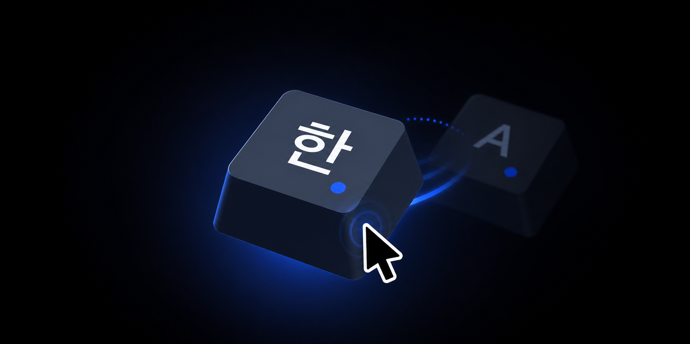
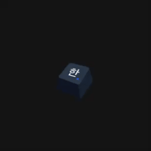

<p align="center">
  
</p>

<h1 align="center">LangToggle</h1>

<p align="center">
  <strong>원격 Mac의 입력 언어를, 화면 위 작은 키 하나로.</strong><br>
  현재 언어를 보여 주고 클릭 한 번으로 다음 입력 소스로 전환하는 macOS 유틸리티.
</p>

## 만든 이유

Chrome Remote Desktop으로 Mac을 사용하다 보면 키 설정이 기대대로 동작하지 않아, 화면 우측 상단의
입력기 버튼을 두 번씩 눌러 언어를 바꿔야 할 때가 있었다. 작은 전환 하나가 작업 흐름을 계속 끊었다.

LangToggle은 그 번거로움에서 출발했다. 화면 위에 **실제 키처럼 보이는 키캡**을 띄우고, 누르면
입력 소스가 바뀌게 했다. 지금 선택된 언어가 키캡에 바로 표시되므로 현재 상태를 확인하기 위해
메뉴를 다시 열 필요도 없다.

Chrome Remote Desktop뿐 아니라 원격 제어 중 한/영 키가 제대로 전달되지 않을 때, 키보드 단축키보다
눈에 보이는 전환 버튼이 편할 때도 그대로 쓸 수 있다.

## 사용법

<p align="center">
  
</p>

- **클릭** — 활성화된 입력 소스를 차례로 순환한다. `ABC`와 `2-Set Korean`만 켜 뒀다면 곧바로
  한/영 전환이 된다. 누를 때 키캡이 실제 키처럼 내려갔다 튕겨 올라오고, 누를 때와 뗄 때
  각각 소리가 난다 — 찰칵.
- **드래그** — 원하는 곳으로 옮긴다. 위치는 자동 저장된다.
- **우하단 모서리에서 드래그** — 키캡 크기를 바꾼다. 28pt에서 88pt 사이, 크기도 자동 저장된다.
  모서리를 그냥 클릭하면 평소대로 언어가 전환된다.
- **우클릭** — 로그인 시 자동 실행, 크기 프리셋, 소리, 아이콘 새로고침, 업데이트 확인, 종료 메뉴를 연다.

키캡은 모든 데스크톱과 전체 화면 앱 위에 떠 있지만, 클릭해도 사용 중인 앱의 포커스를 빼앗지 않는다.
접근성 권한도 필요 없다.

## 설치

```bash
brew install --cask halfmoon-project/tap/langtoggle
```

또는 [최신 릴리스](https://github.com/halfmoon-project/langtoggle/releases/latest)에서 zip 을 받아서:

1. 압축 해제
2. `LangToggle.app` 을 **응용 프로그램(Applications)** 으로 이동
3. 더블클릭

Developer ID 서명 + 애플 공증(Notarized Developer ID)까지 돼 있어 경고 없이 바로 열린다.
`xattr` 를 떼거나 우클릭 열기를 할 필요가 없다.

**로그인 시 자동 실행**을 켜면 재부팅 후에도 뜬다(`SMAppService`).
키캡을 클릭해도 지금 쓰던 앱의 포커스는 그대로다 — 창이 `.nonactivatingPanel` 이라 입력을 뺏지 않는다.

## 업데이트

할 게 없다. 하루에 한 번 조용히 확인하고, 새 버전이 있으면 받아 뒀다가 다음에 실행될 때 그걸로 뜬다.
로그인 시 자동 실행을 켜 뒀다면 그 "다음" 이 다음 로그인이라, 어느 날 그냥 새 버전이 돼 있다.
알림도 안 뜨고 물어보지도 않는다. 기다리기 싫으면 우클릭 → **업데이트 확인**.

실행 중인 앱을 그 자리에서 갈아치우지 않는 건, 아직 메모리에 안 올라온 코드 페이지를 나중에
폴트할 때 터지기 때문이다. [Sparkle](https://sparkle-project.org) 이 설치를 별도 프로세스로
빼 두는 이유이기도 하다. 업데이트 파일은 EdDSA 서명으로 검증하므로 배포 경로가 뚫려도 남의 빌드가
설치되지 않는다.

`brew` 로 깐 경우에도 업데이트는 앱이 직접 한다 — cask 에 `auto_updates true` 가 있어서
`brew upgrade` 가 이미 새로워진 앱을 옛 버전으로 되돌리지 않는다.

> 우클릭 메뉴가 응답하지 않을 때는 터미널에서 `pkill -f LangToggle`로 종료한 뒤 다시 실행한다.

## 언어

한/영에 한정되지 않는다. 전환은 활성화된 입력 소스 전부를 순환하고, 키캡 글리프는 현재
입력 소스의 `kTISPropertyInputSourceLanguages` 첫 값으로 고른다.

| 언어 | 글리프 | | 언어 | 글리프 | | 언어 | 글리프 |
|---|---|---|---|---|---|---|---|
| `en` 영어 | A | | `ru` 러시아어 | Я | | `he` 히브리어 | א |
| `ko` 한국어 | 한 | | `el` 그리스어 | Ω | | `hi` 힌디어 | अ |
| `ja` 일본어 | あ | | `th` 태국어 | ก | | `vi` 베트남어 | Ư |
| `zh` 중국어 | 中 | | `ar` 아랍어 | ع | | | |

찾는 순서는 `zh-Hans` → `zh` → `en` 이다. 지역 태그가 붙어도 기본 글리프를 찾아가고, 표에 없는
언어(독일어·프랑스어처럼 라틴 자판을 쓰는 것들)는 `en` 의 `A` 로 떨어진다.

`한` 을 뺀 모든 글리프에 파란 점이 붙는다 — 라틴 자판이 아니라는 표시다.

> 일본어 IME 의 로마자 입력(英数)처럼 **같은 입력 소스 안에서 모드만 바뀌는 경우**는 구분하지
> 못한다. macOS 가 그걸 별도 입력 소스로 보고하긴 하지만 언어는 똑같이 `ja` 라서 전부 `あ` 로 뜬다.

## 소리

누를 때와 뗄 때 각각 소리가 난다. 우클릭 → **소리** 에서 고르거나 끈다.

| 프리셋 | 구조 |
|---|---|
| 청축 — 찰칵찰칵 | 기본값. 실제 청축 키보드의 밝은 클릭과 바닥 타격 |
| 갈축 — 도각도각 | 실제 갈축 키보드의 옅은 걸림과 단단한 바닥 타격 |
| 적축 — 툭툭 | 실제 적축 키보드의 낮고 매끈한 바닥 타격 |

세 축 모두 실제 키보드 녹음에서 타건 한 번만 자르고 Apple IMA4로 압축한 44.1kHz 모노 샘플을
쓴다. 세 파일과 라이선스를 합쳐 14KB가 안 된다. 누름과 뗌은 같은 녹음을 재사용하고 뗄 때만 작게 재생해,
파일을 두 벌 넣지 않고도 실제 키처럼 들리게 했다. 샘플을 읽지 못하면 `Sound.swift`가 합성한
파형으로 자동 폴백한다.

폴백 파형은 시작 시각이 다른 여러 타격을 합성한다. 소리를 하나 더 넣는 것도
`Sound.profiles`에 한 벌이다 — 우클릭 메뉴는 이 표를 그대로 따라간다. 전체 프리셋은 `--click`으로
이어 들을 수 있다.

출력만 하므로 **권한 요청은 없다**(마이크가 아니다). 다른 앱 소리를 끊거나 밀어내지도 않는다 —
macOS 오디오 믹서에 얹히는 거라 음악은 그대로 나온다. 다만 조용해지면 3초 뒤 오디오 엔진을
놓는다. 스트림을 계속 열어 두면 블루투스 헤드셋이 유휴 상태로 못 내려가 종일 깨어 있게 된다.

## 아이콘 커스텀

`~/Library/Application Support/LangToggle/` 에 같은 이름의 PNG 를 두면 그게 우선 적용된다.
바꾼 뒤에는 우클릭 → 아이콘 새로고침. 번들 내부를 고치면 서명이 깨지므로 이 경로를 쓴다.

- `keycap.png` — 키캡 바디. 모든 언어가 공유한다.
- `<언어코드>.png` — 그 위에 겹쳐 그리는 글리프 레이어(배경 투명). `ko.png`, `ja.png` …

글리프만 바꾸려면 언어 파일 하나만, 키캡 모양까지 바꾸려면 `keycap.png` 를 둔다. 불투명한 통짜
키캡 이미지를 `<언어코드>.png` 로 넣어도 바디를 완전히 덮으므로 그대로 동작한다.
표에 없는 언어도 `de.png` 처럼 파일만 두면 바로 잡힌다.
PNG 가 하나도 없으면 텍스트 배지로 폴백한다.

## 요구사항

- macOS 13 (Ventura) 이상
- **Apple Silicon (arm64) 전용** — Intel Mac 미지원
- 접근성 권한은 필요 없다. 입력 소스 전환에 Carbon `TISSelectInputSource` 를 쓴다.

## 개발

```bash
./make_app.sh             # 빌드 → ad-hoc 서명 → /Applications 설치 → 실행
./make_app.sh dist        # Developer ID 서명 → 공증 → staple → build/LangToggle-<버전>.zip

# 번들 없이 굴릴 때. Sparkle 을 링크하므로 vendor/ 가 있어야 하고, 그건 make_app.sh 가 채운다.
swiftc -O ./*.swift -F vendor -framework Sparkle \
  -Xlinker -rpath -Xlinker @executable_path/vendor -o LangToggle
./LangToggle              # 번들 없이 실행 (Dock 아이콘 없음)
./LangToggle --selftest   # 토글 동작 + 클릭 파형 확인 (assert 가 살아 있어야 하니 -O 없이 빌드)
./LangToggle --dump       # 실제 표시 크기(88px) 렌더를 /tmp/langtoggle-render.png 로
./LangToggle --click      # 소리 프리셋을 순서대로 하나씩 재생

# 업데이트가 왜 안 오는지 볼 때. 번들 안에서 실행해야 Info.plist 가 읽힌다.
/Applications/LangToggle.app/Contents/MacOS/LangToggle --check-update
```

버전은 `make_app.sh` 맨 위 `VERSION` 한 곳에서만 고친다 — Info.plist 와 zip 이름이 이걸 따라간다.
이미 나간 버전이면 `dist` 가 빌드를 시작하기 전에 멈춘다. 다 끝나면 스크립트가 마지막에 출력하는
`gh release create ...` → `appcast.xml` 커밋 → 탭 리포의 cask 갱신 순서를 그대로 따라간다.
**`appcast.xml` 은 릴리스가 올라간 뒤에 커밋한다** — 아직 없는 다운로드 URL 을 가리키기 때문이다.

서명·공증 준비물은 `make_app.sh` 주석에 있고, notarytool 프로필이 없으면 스크립트가 등록 방법을 출력한다.

### Sparkle

프레임워크는 리포에 없다. `make_app.sh` 가 버전과 SHA256 을 박아 두고 없으면 받아서 `vendor/` 에
캐시한다. 번들에 들어가는 건 원본(3.0MB)이 아니라 이 앱에 필요한 것만 남긴 1.1MB 짜리다 —
`slim_sparkle()` 이 매 빌드마다 깎는다.

| 뗀 것 | 절감 | 이유 |
|---|---|---|
| x86_64 슬라이스 | 950KB | arm64 전용 앱이다 |
| `XPCServices/` | 424KB | 샌드박스 앱 전용. Sparkle 문서도 떼라고 안내한다 |
| `Headers`·`Modules` | 224KB | 빌드할 때만 필요하고, 빌드는 `vendor/` 원본을 본다 |
| 로컬라이제이션 34개 | 292KB | 무음 업데이트라 Sparkle UI 를 볼 일이 없다. Base + `ko` 만 남긴다 |

중첩 번들이 생겼으므로 서명은 안쪽부터 바깥으로 한다(`Updater.app` → `Autoupdate` → 프레임워크 → 앱).
`--deep` 은 쓰지 않는다 — 중첩 번들에 바깥 앱의 서명 옵션을 덮어써서 공증에서 걸린다.
로컬 빌드는 `SUEnableAutomaticChecks` 를 꺼서 개발 중인 빌드가 배포판으로 조용히 덮이지 않게 한다.

업데이트 서명용 EdDSA 개인키는 키체인에만 있다. **이걸 잃으면 기존 사용자에게 업데이트를 영영 못
보낸다** — 새 키로 서명한 걸 안 받기 때문이다. 백업은 `vendor/bin/generate_keys -x <파일>`.

아이콘은 `build_icons.py` 가 만든다. `assets/design/keycap-master-v2.png` 는 우측 상단에서 본 3/4
대각선 키캡이고 윗면이 `#ff00ff` 로 비워져 있다 — 그 마커 영역을 찾아 윗면 색으로 칠한 게
`keycap.png`, 같은 영역에 글리프를 원근 변환으로 얹은 게 언어별 레이어다. 바디를 모든 언어가
공유하므로 실루엣이 픽셀 단위로 같아 전환할 때 흔들리지 않고, 언어를 늘려도 번들은 몇 KB 만 는다
(전체 `assets/*.png` 가 36KB). 표시 크기가 44pt(레티나 88px)라 아이콘은 176px 로 굽는다 —
`.icns` 는 1024px 를 요구해서 축소 전 원본을 `assets/design/appicon.png` 에 따로 남기고, 이건
번들에 안 들어간다.

언어를 추가하려면 `GLYPHS` 에 한 줄 넣고 다시 돌린 뒤 `main.swift` 의 `glyphs`(텍스트 폴백)도
같이 고친다. 폰트는 키캡 굵기(SemiBold/W6)에 맞춰 스크립트별로 고르고 — 한글 Apple SD Gothic Neo,
일본어 Hiragino Sans, 중국어 Hiragino Sans GB, 데바나가리 Kohinoor, 아랍어 Geeza Pro — 전용 폰트에
없는 글리프는 Arial Unicode MS 로 떨어진다. 그 글리프들을 전부 가진 유일한 시스템 폰트지만
Regular 한 종류뿐이라 우선순위가 맨 뒤다. 실제로 글리프를 가졌는지 cmap 으로 확인하므로 두부(.notdef)가
구워지는 대신 빌드가 실패한다.
색은 [halfmoon 디자인 시스템](https://github.com/halfmoon-project/halfmoon-design) 토큰을 따른다
(gray.800 바디, gray.700 윗면, gray.50 글리프, blue.600 액센트).

```bash
uv run --with pillow --with numpy --with fonttools python build_icons.py
```

## 라이센스

[MIT](./LICENSE)
